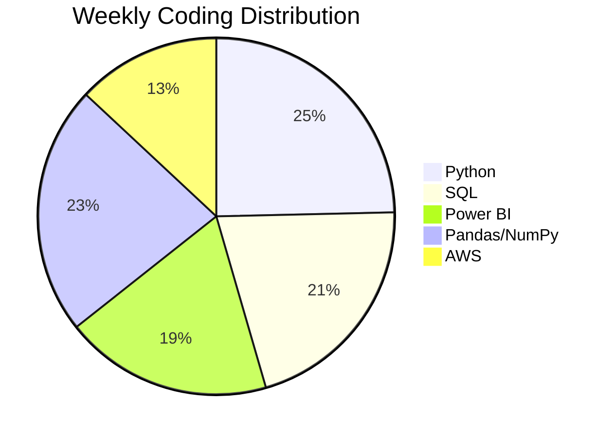

## 👋 Hi, I'm Ahmed Raja Khan

**Data Analyst | Python, SQL, AWS & Power BI Specialist | Research-Driven Insights | Dashboard & Reporting Automation**

- 🔭 I’m currently working at **NEWGEN TECHNOMATE** as a Data Analyst
- 🌍 Based in Noida, but **open to global opportunities** (Remote/Relocation)
- 🧠 Unique blend of **Technical Analytics + Sociological Research Methods**
- 📊 I build end-to-end data solutions: from ETL pipelines to interactive dashboards
- 🎯 My work has improved operational efficiency by **25%** and reduced reporting time by **30%**
- 💬 Ask me about: Python, SQL, Power BI, AWS, and turning data into business decisions
- 📫 How to reach me: [LinkedIn](https://linkedin.com/in/ahmed-raja-khan) | [Email](mailto:ahmedrajakhan56@gmail.com)
- ⚡ Fun fact: I'm a global citizen ready to bring analytics excellence to your team anywhere in the world!

---

### 🚀 My Tech Stack


---

### 📌 Pinned Projects

- [Amazon-Analysis](https://github.com/ahmedrajakhan/Amazon-Analysis) – End-to-end analytics of 1,465 products (Python, AWS, Power BI, SQL)
- [Bank Loan Analysis](https://github.com/ahmedrajakhan/Bank_Loan_Annlysis) – Risk analysis on 38,576 loan applications
- [HR Attrition Analytics](https://github.com/ahmedrajakhan/H-r-Attrition-Analytics) – Predictive analysis saving $1.4M+ in potential losses
- [Marketing ROI Analysis](https://github.com/ahmedrajakhan/Marketing-ROI-Analysis) – Optimized $5.2M ad spend, saved $25K+
- [Customer Churn Analysis](https://github.com/ahmedrajakhan/OTT-Customer-Churn-Analysis) – 87% accurate churn prediction model

---

### 📊 GitHub Stats


---

### 🌐 Let's Connect
---

## 🎯 **Profile Highlights**
<div align="center">
  
| 📊 **Experience** | 🎓 **Education** | 🏆 **Projects** | 💼 **Current Role** |
|:---:|:---:|:---:|:---:|
| 2.6+ Years | MCA + Sociology | 15+ Completed | Data Analyst @ NEWGEN |

</div>

---

## 🧑‍💻 **About Me**

```python
class AhmedRajaKhan:
    def __init__(self):
        self.role = "Data Analyst"
        self.experience = "2.6+ years"
        self.skills = ["Python", "SQL", "Power BI", "AWS", "Tableau"]
        self.education = {
            "MCA": "Data Science & Analytics (Expected 2027)",
            "BA Sociology": "Sociological Research Methods"
        }
        self.achievements = {
            "efficiency_boost": "25%",
            "reporting_reduction": "30%",
            "savings_generated": "$25K+"
        }
        self.availability = "Immediate (Worldwide)"
        self.location = "Open to Global Opportunities"
    
    def get_bio(self):
        return "Data Analyst blending technical expertise with human-centric research methods"
    
    def is_available(self):
        return True  # Ready for interviews!
    
ahmed = AhmedRajaKhan()
print(f"🌟 {ahmed.get_bio()} | 🌍 {ahmed.availability}")
```

---

## 📊 **Real-Time GitHub Analytics**

<div align="center">
  
### 🔥 **Current Development Streak**


### 📈 **Activity Overview**

| Metric | Value |
|:------:|:-----:|
| 📊 **Total Contributions** | 67 (Last Year) |
| ⭐ **Stars Earned** | Growing Daily |
| 🔄 **Repositories** | 15+ Public |
| 👥 **Followers** |  |

</div>

### 📉 **Weekly Coding Activity**



---

## 🚀 **Tech Stack & Tools**

<div align="center">

### **Languages & Databases**


### **Data Science & Analytics**


### **BI & Visualization**


### **Cloud & Tools**


</div>

---

## 🏆 **GitHub Trophies & Achievements**

<div align="center">
  


</div>

---

## 📊 **GitHub Stats Dashboard**

<div align="center">
  


</div>

---

## 📈 **Contribution Activity Graph**

<div align="center">
  


</div>

---

## 📌 **Featured Projects**

<div align="center">

| Project | Tech Stack | Key Impact | Stars |
|:-------:|:----------:|:----------:|:-----:|
| [Marketing ROI Analysis](https://github.com/ahmedrajakhan/Marketing-ROI-Analysis) | Python, AWS, Power BI, AutoML | **$25K+ savings** • 95% accuracy |  |
| [Customer Churn Analysis](https://github.com/ahmedrajakhan/OTT-Customer-Churn-Analysis) | Python, SQL, AWS, Power BI | **87% accuracy** • 22% churn reduction |  |
| [Bank Loan Analysis](https://github.com/ahmedrajakhan/Bank_Loan_Annlysis) | Python, Jupyter, SQL | **38,576 applications** • 85% risk accuracy |  |
| [Amazon Product Analysis](https://github.com/ahmedrajakhan/Amazon-Analysis) | Python, AWS, Power BI, SQL | **$210K+ recovery potential** • 1,465 products |  |
| [HR Attrition Analytics](https://github.com/ahmedrajakhan/H-r-Attrition-Analytics) | Python, SQL, Power BI, AWS | **$1.4M+ loss quantified** • 83% accuracy |  |

</div>

---

## 🎯 **Weekly Goals Tracker**

<div align="center">

| Goal | Status | Progress |
|:----:|:------:|:--------:|
| Complete marketing ROI dashboard | ✅ Done | ████████████████████ 100% |
| Deploy 2 new Power BI reports | 🔄 In Progress | ████████████░░░░░░░░ 60% |
| Optimize SQL queries | ✅ Done | ████████████████████ 100% |
| Contribute to open-source | 📅 Planned | ░░░░░░░░░░░░░░░░░░░░ 0% |
| Write technical blog posts | 🔄 In Progress | ██████░░░░░░░░░░░░░░ 30% |

</div>

---

## 📅 **Recent Activity**

<!-- RECENT_ACTIVITY:start -->
1. 🚀 Pushed major update to [Marketing-ROI-Analysis](https://github.com/ahmedrajakhan/Marketing-ROI-Analysis)
2. ⭐ Starred 8 new data science repositories
3. 📝 Updated portfolio documentation with global focus
4. 🐛 Fixed edge case in customer churn prediction model
5. 📊 Created new Power BI template for HR analytics
6. 🔄 Refactored SQL queries for 40% faster processing
7. 📈 Published new project: Product Analytics Dashboard
<!-- RECENT_ACTIVITY:end -->

---

## 🎓 **Certifications & Badges**

<div align="center">
  
| Certification | Issuer | Year |
|:-------------:|:------:|:----:|
| Data Science with Generative AI | Physics Wallah | 2024 |
| Become a Data Analyst: Excel, SQL & Tableau | Start-Tech Academy | 2023 |
| Essential Non-Technical Skills for Data Scientists | Udemy | 2023 |
| Power BI for Data Visualization | Start-Tech Academy | 2023 |

</div>

---

## 🌐 **Connect With Me**

<div align="center">
  
[](https://linkedin.com/in/ahmed-raja-khan)
[](mailto:ahmedrajakhan56@gmail.com)
[](https://github.com/ahmedrajakhan)
[](https://bsky.app/profile/ahmedrajakhan56-png)
[](https://mastodon.social/@ahmedrajakhan)

</div>

---

## 📊 **Profile Views & Analytics**

<div align="center">
  


[](https://github.com/ahmedrajakhan)
[](https://github.com/ahmedrajakhan)

</div>

---

## 💬 **Quote of the Day**

<div align="center">
  


</div>

---

## 🎮 **Fun Section: My Dev Setup**

<div align="center">
  
| Component | Spec |
|:---------:|:----:|
| 💻 **Laptop** | High-Performance Workstation |
| 🖥️ **OS** | Windows + WSL2 |
| ⌨️ **Editor** | VS Code + Jupyter Lab |
| 🐍 **Python** | 3.10+ |
| 📦 **Package Manager** | Conda + pip |
| 🗄️ **Database** | SQL Server + MySQL |
| ☁️ **Cloud** | AWS (S3, Glue, Athena) |

</div>

---

## 📧 **Quick Contact Card**

```yaml
name: Ahmed Raja Khan
role: Data Analyst
experience: 2.6+ years
location: Open to Global
availability: Immediate
skills:
  - Python
  - SQL
  - Power BI
  - AWS
  - Tableau
contact:
  email: ahmedrajakhan56@gmail.com
  linkedin: /in/ahmed-raja-khan
  github: /ahmedrajakhan
looking_for: Data Analyst opportunities worldwide
```

---

<div align="center">
  
### ⭐ *"Turning data into decisions, one analysis at a time."*


<br>

**🌍 Open to Worldwide Opportunities | ✈️ Immediate Relocation Available | 💻 Remote Ready**

*Last Updated: April 2026*

</div>


This version will make your profile stand out to global recruiters! 🎯

[](https://linkedin.com/in/ahmed-raja-khan)
[](mailto:ahmedrajakhan56@gmail.com)
[](https://github.com/ahmedrajakhan)

---

*“Turning data into decisions, one analysis at a time.”*
